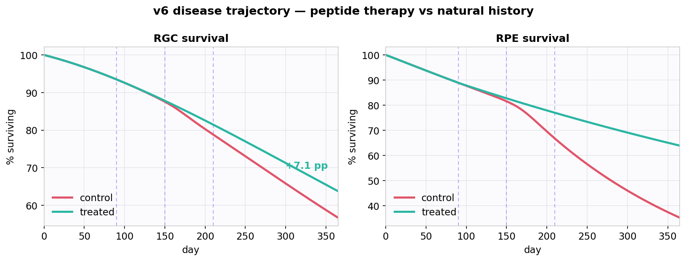
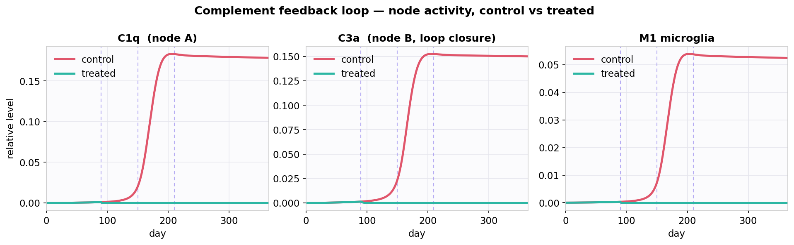
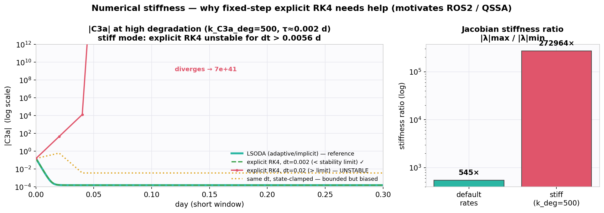
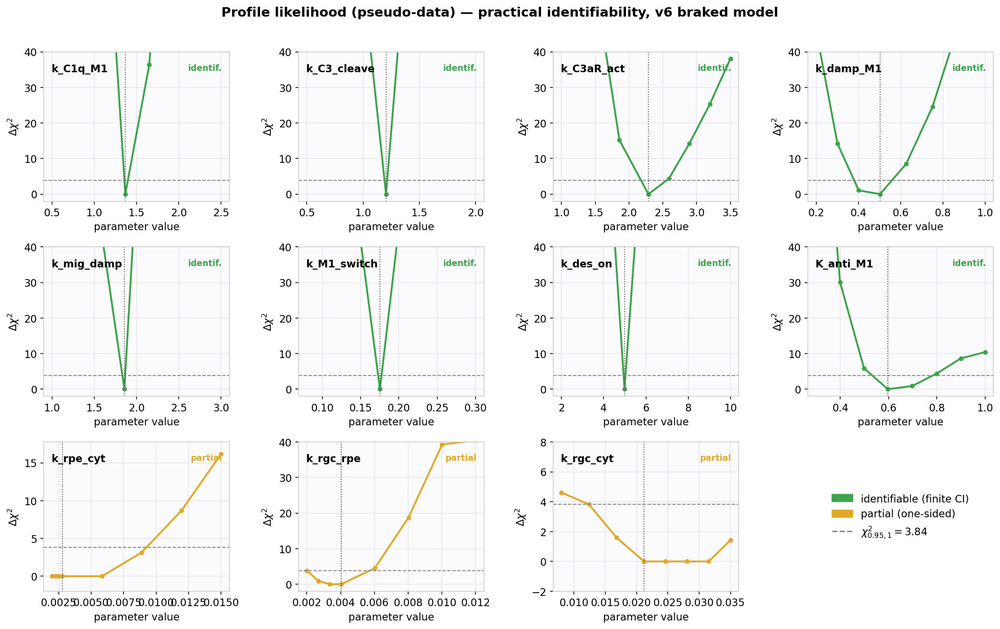
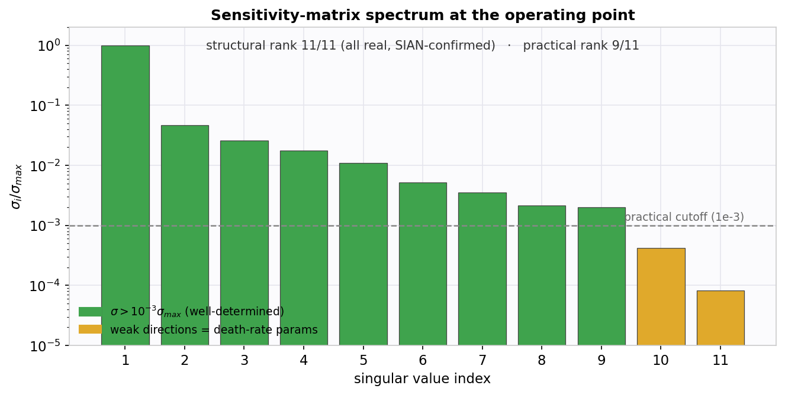
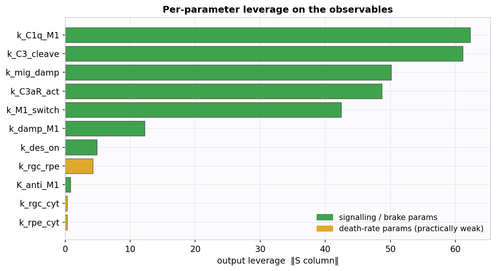
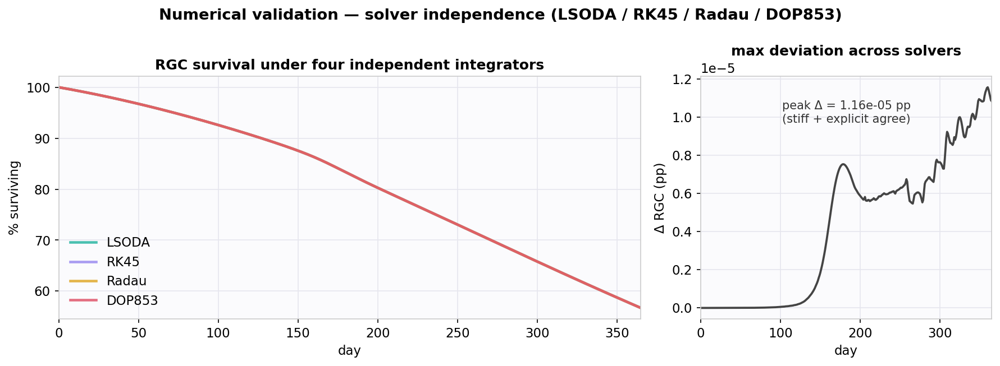
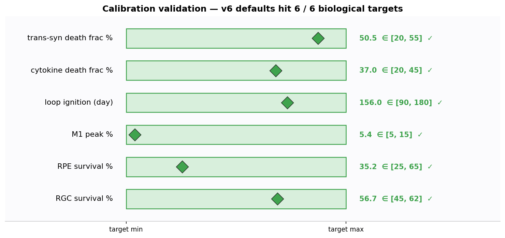

> **Note:** All model parameters are pseudodata generated programmatically for
> methodological demonstration. Parameter ranges are informed by published
> literature (see references) but **no values are derived from proprietary
> experimental data, internal assay results, or employer-affiliated sources.**

# QSP CNS Neurodegeneration Model v6 — Complement-Driven Neurodegeneration

> **A quantitative systems pharmacology (QSP) model of normal-tension glaucoma (NTG):
> the RPE–DAMPs–complement–microglial vicious cycle with two saturating brakes and an
> intravitreal peptide therapy — plus a full practical + structural identifiability
> analysis.**


---

## Overview

This tool models the self-sustaining complement feedback loop in NTG, with v6 adding
two saturating **brakes** that bound the runaway (C3aR desensitisation; anti-inflammatory
M1 suppression):

```
IOP / Mechanical Stress
        ↓
    RPE death  ──→  DAMPs (ATP, HMGB1)
        ↓                   ↓
  [Trans-synaptic]    TLR4 / NF-κB bootstrap
  RGC degeneration         ↓
   (structural,        M_mig (migrating microglia)
  drug-independent)        ↓
                   ★ COMPLEMENT FEEDBACK LOOP ★
                   M1 → C1q            ← Loop Node A
                          ↓
                   C4b2a convertase
                          ↓
                   C3 cleavage → C3a   ← Loop Node B (CLOSES LOOP)
                          ↓                    ↓
                   C3aR → M1 ◄──────────────────  C5a → M_mig
                     ⟂ BRAKE 1 (R_des desensitisation)
                          ↓
                   Pro-inflam Cytokines (IL-1β, IL-6, TNF-α)
                     ⟂ BRAKE 2 (anti-inflammatory M1 suppression)
                          ↓
                   Direct RGC death ← drug-accessible
```

An intravitreal peptide (C1q block, C3aR/C5aR antagonism, M1→M2 switch) disrupts the
loop, reducing cytokine-mediated RGC death. The model quantifies the drug-accessible
fraction and its ceiling relative to the structural trans-synaptic pathway.

---

## What's New in v6 (vs v5.5)

| Area | v5.5 | v6 | Why |
|---|---|---|---|
| **Model** | 16 states (14 bio + 2 PK) | **17 states** (+ `R_des`) | two saturating **brakes** — C3aR desensitisation (`R_des`) and anti-inflammatory M1 suppression `1/(1+Cyt_anti/K_anti_M1)` — bound the runaway loop |
| **Integrator** | in-browser RK4 only | **RK4 / RK45 / ROS2** toggle | adaptive (RK45) and L-stable Rosenbrock (ROS2) handle the stiff regime instead of relying on the state-clamp |
| **PK & dosing** | 5 doses, days 0–28, fast clearance | **3 bi-monthly doses (d90/150/210), realistic PK (t½ ≈ 6.9 d)** | the old schedule cleared ~100 d before loop ignition (~d156); window-matched dosing restores efficacy |
| **Calibration** | 180-day run, 6 targets | **365-day run**; targets now include loop-ignition timing and M1 peak | longer horizon captures the full ignition → resolution cascade |
| **Identifiability** | ABC width-ratio + MATLAB PL + SIAN/DAISY; reported some params **structurally non-identifiable** | constrainability separated from identifiability; pseudo-data PL; SIAN local + global + output ablation; **all params structurally identifiable** | rigorous methodology; corrects the width-ratio↔identifiability conflation |

**Headline scientific change:** the two brakes make the previously non-identifiable
parameters **structurally identifiable** — proven on the *same* four-output set v5.5 used
(see the identifiability section). The reported drug effect is also more conservative
(≈ +7 pp vs the old +11–12 pp) because v6 uses realistic intravitreal PK rather than the
fast-clearance assumption.

---

## Disease Trajectory



Calibrated 365-day simulation, three bi-monthly intravitreal injections (▍ days
90/150/210) under realistic intravitreal PK (t½ ≈ 6.9 d). The treated arm diverges as
complement-loop suppression accumulates, reaching **≈ +7 pp** RGC protection by day 365.
RPE shows stronger local protection because the peptide acts upstream of the
inflammatory RPE-death term.

## Complement Loop Nodes



C1q (node A) and C3a (node B, loop closure) collapse under treatment, and M1 microglia
fall in parallel — loop disruption, not partial attenuation. The brakes keep the control
arm bounded rather than diverging.

---

## Model Architecture

**17-state braked ODE.** v5.5's 14 biological states + 2 PK compartments (`A_eye`,
`C_pep`) + **`R_des`** (C3aR desensitisation, brake 1). Brake 2 multiplies the TLR4
bootstrap and C3aR terms by `1/(1 + Cyt_anti/K_anti_M1)`.

| Loop | Type | Drug target |
|------|------|-------------|
| Complement amplifier M1→C1q→C3→C3a→C3aR→M1 | 🔴 vicious (brake 1 saturates it) | C1q block; C3aR block |
| RPE–DAMP–cytokine | 🔴 vicious (brake 2 saturates it) | M1→M2 switch; migration block |
| M2–NTF protective | 💚 virtuous | preserve (enhanced via M2 recovery) |

**Two RGC death pathways with different drug accessibility** — trans-synaptic
`k_rgc_rpe·(1−RPE)` is structural and drug-independent; cytokine-direct `k_rgc_cyt·Cyt_pro`
is drug-accessible. This split sets the theoretical efficacy ceiling and is also the
origin of the identifiability structure below.

**Solvers.** The dashboard engine carries a RK4 / RK45 (adaptive Dormand–Prince) / ROS2
(L-stable Rosenbrock) toggle; all three agree in the clamped dashboard at default and stiff
parameters (see the stiffness section for the role of the clamp).

---

## Numerical Stiffness & QSSA



The model spans a wide range of timescales — fast complement turnover (C3a, C5a) against
slow neurodegeneration (RGC/RPE loss over months) — so it is **stiff**. The Jacobian
stiffness ratio is **545× at default rates** and reaches **~2.7×10⁵** when complement
degradation is fast (`k_C3a_deg = 500`, τ ≈ 0.002 d).

**Why a fixed-step explicit RK4 is not a stiff solver.** Its absolute-stability region is
bounded, so the step must satisfy `dt < ~2.78/|λ|max` (≈ 0.0056 d at the stiff rate). At
`dt = 0.02` it is 3.6× over the limit and **diverges to ~10⁴¹** within a few steps (red).
The dashboard's `max(v,0)` **state-clamps incidentally keep it bounded** (orange) — but
clamping is a stabiliser, not a solution: the clamped trajectory is biased and does not
track the reference. This is why "RK4 doesn't crash" is not the same as "RK4 is correct."

**The principled fixes**
- **ROS2** — the 2-stage **L-stable Rosenbrock** method (γ = 1 + 1/√2) with a
  finite-difference Jacobian is unconditionally stable on the stiff modes and needs no
  clamp. That is why it sits in the solver toggle alongside RK4 and adaptive RK45.
- **QSSA** — under timescale separation the fast species can be eliminated algebraically:
  C3a relaxes almost instantly to its quasi-steady state
  `C3a* = k_C3a_frac·k_C3_cleave·C1q·C3 / k_C3a_deg`. Substituting it removes the stiff
  mode entirely (the same reduction that yields Michaelis–Menten from mass action).

At **default** parameters the stiffness is mild enough that every integrator agrees (the
solver-independence check, fig6); it only bites at fast complement rates, where ROS2 /
implicit methods and the QSSA reduction — not a smaller explicit step — are the right tools.

---

## Identifiability Analysis

A central contribution of v6 is a **layered identifiability analysis** that keeps three
distinct questions separate — and corrects a common conflation (posterior width ≠
identifiability). Because no primary data exist, the calibration step is **plausibility
calibration**, not Bayesian inference.

### Layer 1 — Plausibility calibration & constrainability (ABC-SMC)

[PyABC](https://pyabc.readthedocs.io/) ABC-SMC against interval targets on emergent
behaviour. **Reported as constrainability, not identifiability:** with an interval
distance the posterior is the prior truncated to the feasible region, so posterior/prior
width reflects feasible-region geometry (and the literature-derived prior), *not* data
constraint. (`--distance smooth` gives a data-shaped posterior if needed.)

### Layer 2 — Practical identifiability (profile likelihood)



Pseudo-data profile likelihood on the braked equations (observables RGC, RPE, M1, C1q,
C3a × 12 timepoints; χ²_min = 45.7 > 0, so no spurious-flat plateau). **8 of 11
parameters identifiable** (finite CI, U-shaped profile crossing χ²₀.₉₅,₁ = 3.84); the
**3 death-rate parameters are partial** (one-sided bounds) — they trade off against each
other because the survival curves constrain *total* death rate, not its pathway split.

### Layer 3 — Structural identifiability (SIAN + sensitivity rank)



`StructuralIdentifiability.jl` `assess_local_identifiability` on the 15-state control arm:
**all 11 parameters and all 15 states are locally structurally identifiable.** Numerically,
the sensitivity matrix has **rank 11/11 at every generic parameter point** (all singular
values real, ≫ the 1e-8 finite-difference floor). The "practical rank 9/11" seen at the
calibrated operating point is a *threshold + collinearity* artifact: the two smallest
singular values (~2×10⁻⁴) are the death-rate directions, real but ~1000× weaker than the
strongest, and the natural-history regime is additionally collinear (Cytpro ≈ 1−RPE).



**Global confirmation (reduced subsystem).** The full 15-state global computation OOMs
(the documented Gröbner-elimination wall). On the reduced `{RPE, RGC}` subsystem with
cytokine as a known input, `assess_identifiability` returns all three death-rate
parameters **`:globally` identifiable** in 16 s, and `find_identifiable_functions`
returns the **bare parameters** (not combinations) — they do not confound each other at
all once cytokine is measured independently.

### Result

> The model is **structurally identifiable in principle.** The three death-rate
> parameters are only **practically** non-identifiable — collinear in the natural-history
> regime — and become **globally** identifiable once cytokine is measured or perturbed
> independently of RPE loss. This is a *practical* limitation removable by experimental
> design, **not** a structural one.

> **vs v5.5 (SIAN-proven):** the earlier SIAN/DAISY analysis reported some parameters
> structurally non-identifiable from {RPE, RGC, M1, C1q}. The v6 model is structurally
> identifiable from that **same four-output set** — `assess_local_identifiability` returns
> all-true with C3a left as a *hidden* state (`glaucoma_v6_SIAN_4out.jl`), so the added
> C3a output is sufficient but not necessary. Because structural identifiability depends
> only on the equations and v6 differs from v5.5 structurally by the two saturating brakes
> (R_des desensitisation + anti-inflammatory suppression), **those extra observable
> dynamics — not any added output — are what resolve the non-identifiability.**

---

## Validation Summary

Every load-bearing result is backed by a reproducible check — numerical correctness,
calibration, identifiability, and therapeutic dynamics.





| Check | What was tested | Result | Evidence |
|---|---|---|---|
| Solver independence | control arm under LSODA / RK45 / Radau / DOP853 | peak deviation **1.2×10⁻⁵ pp** over 365 d | fig6 |
| Dashboard solver toggle | in-browser RK4 / RK45 / ROS2 engine | all three agree at default **and** stiff params | dashboard |
| Cross-engine parity | dashboard JS vs Python (SciPy) vs R (deSolve) | bit-for-bit match with shared parameters → RGC 56.70 / RPE 35.23 / M1 5.39 / ignition d156 | numeric |
| Stiffness handling | explicit RK4 vs implicit/L-stable at `k_C3a_deg`=500 (stiffness ratio **2.7×10⁵**) | explicit RK4 diverges to ~10⁴¹ for dt > 0.0056 d; ROS2 / implicit stable; QSSA removes the fast mode | fig8 |
| Calibration to targets | v6 defaults vs 6 biological endpoints | **6 / 6** inside band | fig7 |
| Practical identifiability | pseudo-data profile likelihood, 11 params | **8 identifiable, 3 partial**; χ²_min = 45.7 > 0 (no spurious plateau) | fig3 |
| Structural identifiability (local) | SIAN `assess_local_identifiability`, 15-state | **all 11 params + 15 states identifiable** | fig4 · `glaucoma_v6_SIAN.jl` |
| Structural rank (numerical) | sensitivity-matrix SVD at generic points | **rank 11 / 11**, matches SIAN (operating-point 9/11 is a threshold artifact) | fig4 · fig5 |
| Global identifiability | SIAN `assess_identifiability`, reduced subsystem | all 3 death params **`:globally`**; `find_identifiable_functions` returns the bare parameters | `glaucoma_v6_SIAN_reduced.jl` |
| Output-set ablation | SIAN with C3a hidden (4 outputs) | **still all identifiable** → the brakes, not the C3a output, are the cause | `glaucoma_v6_SIAN_4out.jl` |
| Therapeutic effect | control vs treated, realistic intravitreal PK + disease-window dosing | **+7 pp** RGC; C1q/C3a/M1 collapse under treatment | fig1 · fig2 |

---

## Experimental Priority — Identifiability-Driven

The three death-rate parameters cannot be separated by **more survival curves** — they
are degenerate against each other in the natural-history regime. The decisive experiment
**breaks the Cytpro ↔ RPE-loss collinearity**:

| Priority | Experiment | Resolves |
|----------|-----------|----------|
| 1 | Cytokine-neutralisation / C3aR-block arm (drives Cyt_pro down while IOP-driven RPE loss continues) | `k_rgc_cyt` separately from `k_rgc_rpe` |
| 2 | RPE-ablation + peptide rescue (isolates the trans-synaptic pathway) | `k_rgc_rpe`, trans-syn fraction |
| 3 | Direct C3a / C1q time-course during loop ignition | complement loop-gain parameters |

This is distinct from the sensitivity-driven roadmap in the dashboard (which ranks by
output leverage); here the ranking is by **what makes the degenerate parameters
identifiable.**

---

## Running it

- **Dashboard:** open `qsp_glaucoma_dashboard.html` in a browser (no build step); RK4/RK45/ROS2 toggle, calibration / UQ / sensitivity panels.
- **R/Shiny:** `shiny::runApp("glaucoma_qsp_v6.R")` — needs `deSolve`, `shiny`, `shinydashboard`.
- **Python identifiability:** `pip install numpy scipy pyabc matplotlib`, then
  `python glaucoma_profile_likelihood_v6.py` (practical) and
  `python glaucoma_structural_id_v6.py` (structural rank). `python make_figures.py` regenerates these figures.
- **Julia (structural ID):** `using Pkg; Pkg.add("StructuralIdentifiability")`, then
  `include("glaucoma_v6_SIAN.jl"); assess_local_identifiability(ode)`. Use
  `glaucoma_v6_SIAN_reduced.jl` for the global / discrete-alias check, and
  `glaucoma_v6_SIAN_4out.jl` for the output-set ablation (identifiable without C3a).

See `glaucoma_v6_identifiability_results.md` for the full written analysis.

---

## Reference

Gao et al. (2026), complement–microglia feedback in normal-tension glaucoma.

> © 2026 tjmb03. Provided for educational and methodological demonstration purposes.

*Built with Plotly.js · vis-network · in-browser RK4/RK45/ROS2 · PyABC · StructuralIdentifiability.jl · matplotlib*
