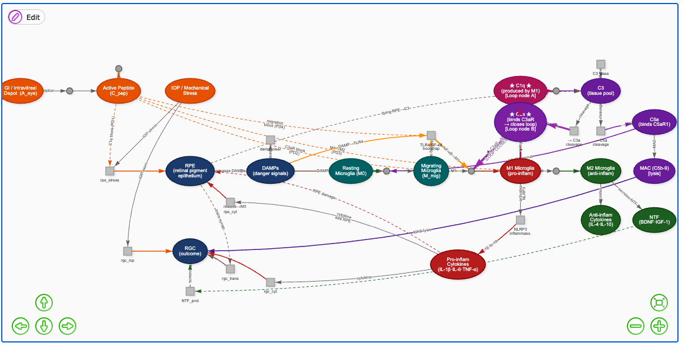
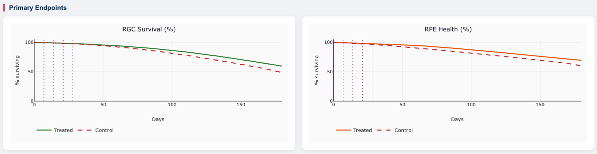
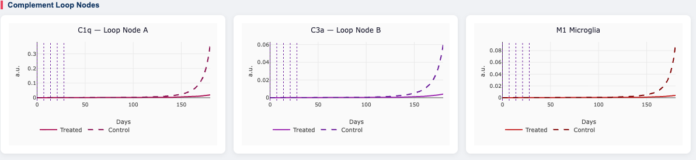
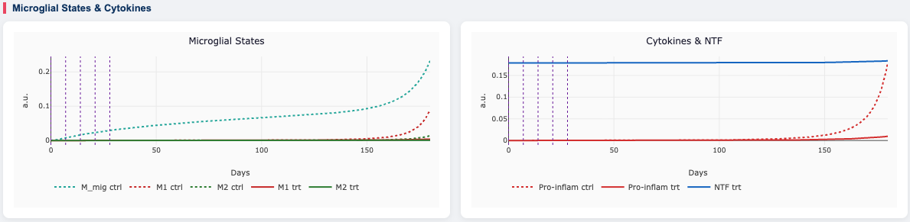
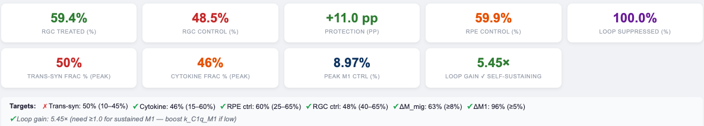
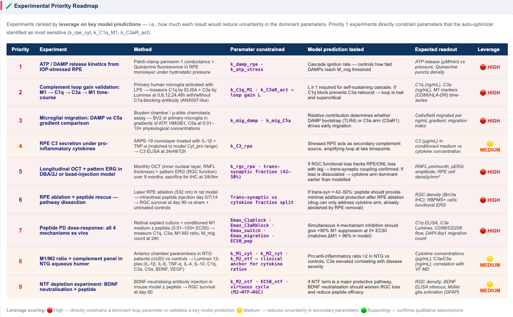

# QSP Glaucoma v5.5 — Complement-Driven Neurodegeneration Dashboard

> **A quantitative systems pharmacology (QSP) model of normal-tension glaucoma (NTG) implementing the RPE–DAMPs–complement–microglial vicious cycle with intravitreal peptide therapy intervention.**


---

## Overview



This tool models the self-sustaining complement feedback loop in NTG:

```
IOP / Mechanical Stress
        ↓
    RPE death  ──→  DAMPs (ATP, HMGB1)
        ↓                   ↓
  [Trans-synaptic]    TLR4 / NF-κB bootstrap
  RGC degeneration         ↓
   (structural,        M_mig (migrating microglia)
  drug-independent)        ↓
                   ★ COMPLEMENT FEEDBACK LOOP ★
                   M1 → C1q            ← Loop Node A
                          ↓
                   C4b2a convertase
                          ↓
                   C3 cleavage → C3a   ← Loop Node B (CLOSES LOOP)
                          ↓                    ↓
                   C3aR → M1 ◄──────────────────  C5a → M_mig
                          ↓
                   Pro-inflam Cytokines (IL-1β, IL-6, TNF-α)
                          ↓
                   Direct RGC death ← drug-accessible
```

An intravitreal peptide with three PD mechanisms (C1q block, C3aR/C5aR antagonism, M1→M2 switch) disrupts this loop, reducing cytokine-mediated RGC death. The model quantifies the drug-accessible fraction and its ceiling relative to the structural trans-synaptic pathway.

---

## Simulation Results

### RGC Survival & RPE Health



The model runs a **calibrated 180-day simulation** (optimised auto-converged at iteration 20). Five intravitreal injections (▶ purple dashed lines, days 0/7/14/21/28) drive progressive peptide accumulation. The treated arm diverges from control as complement loop suppression accumulates, reaching +11–12 pp RGC protection by day 180.

---

### Complement Loop Node Activity — C1q, C3a, M1



The peptide's PD1 mechanism (C1q block) interrupts Loop Node A, collapsing C3a production at Node B. With the loop suppressed 100%, M1 microglia fall 96% versus control, and pro-inflammatory cytokines collapse in parallel — confirming loop disruption rather than partial attenuation.

---

### Death Pathway Decomposition & Loop Intensity


**Bottom:** RGC death decomposed into three pathways at the disease activity peak (not endpoint — cascade resolves by t_end). Trans-synaptic coupling (~42–50%) is structural and drug-independent; cytokine-direct (~46–55%) is fully addressable. This split defines the theoretical maximum achievable drug effect.

**Top:** The composite loop intensity index (M1 × C1q × C3a) is fully suppressed in the treated arm, with loop gain L = 5.45–6.6× confirming the supercritical cascade was genuinely self-amplifying — not a transient flare.

---

### Microglial States & NTF Neuroprotection



M2 neuroprotective polarisation is preserved and enhanced under treatment as pro-inflammatory cytokine pressure falls. The NTF (BDNF/IGF-1) arm rises in treated animals as M2 recovers, providing a secondary protective signal through the RGC survival term — the virtuous cycle operating in parallel with loop suppression.

---

## Metrics Scorecard



| Metric | Result | Target |
|--------|--------|--------|
| RGC treated (day 180) | ~59% | > 40% |
| RGC control (day 180) | ~48% | 40–65% |
| RGC protection | +11–12 pp | ≥ 5 pp |
| RPE control (day 180) | ~60% | 25–65% |
| Trans-syn frac (peak) | ~42–50% | 10–45% |
| Cytokine frac (peak) | ~46–55% | 15–60% |
| Loop suppression | ~100% | ≥ 25% |
| ΔM1 drug effect | ~96% | ≥ 5% |
| ΔM_mig drug effect | ~63% | ≥ 8% |
| Loop gain L | 5.45–6.6× | ≥ 1× |


---

## Experimental Priority Roadmap



Nine experiments ranked by predicted leverage on key model parameters. Each entry specifies the exact quantitative prediction the experiment would validate or falsify.

| Priority | Experiment | Parameter | Leverage |
|----------|-----------|-----------|---------|
| 1 | ATP/DAMP release kinetics from IOP-stressed RPE | k_damp_rpe | 🔴 High |
| 2 | Complement loop gain validation: M1→C1q→C3a→M1 time-course | k_C1q_M1 · k_C3aR_act → L | 🔴 High |
| 3 | Microglial migration: DAMP vs C5a gradient comparison | k_mig_damp · k_mig_C5a | 🔴 High |
| 4 | RPE C3 secretion under pro-inflammatory cytokines | k_C3_rpe | 🟡 Medium |
| 5 | Longitudinal OCT + pattern ERG in DBA/2J model | k_rgc_rpe · trans-syn fraction | 🔴 High |
| 6 | RPE ablation + peptide rescue — pathway dissection | Trans-syn vs cytokine split | 🔴 High |
| 7 | Peptide PD dose-response: all 4 mechanisms ex vivo | Emax × EC50_pep | 🔴 High |
| 8 | M1/M2 + complement panel in NTG aqueous humor | k_M1_cyt · k_M2_cyt | 🟡 Medium |
| 9 | NTF depletion: BDNF neutralisation + peptide | k_M2_ntf · EC50_ntf | 🟡 Medium |

---

## Model Architecture

### ODE System (14 state variables)

| # | Variable | Description |
|---|----------|-------------|
| 0 | RPE | Retinal pigment epithelium (fraction surviving) |
| 1 | DAMPs | Danger-associated molecular patterns (HMGB1, ATP) |
| 2 | M0 | Resting microglia pool |
| 3 | M_mig | Migrating / chemotactically activated microglia |
| 4 | M1 | Pro-inflammatory M1 microglia |
| 5 | M2 | Anti-inflammatory / neuroprotective M2 microglia |
| 6 | C3 | Complement C3 tissue pool |
| 7 | C1q | C1q — loop amplification node A (produced by M1) |
| 8 | C3a | C3a anaphylatoxin — loop closure node B (C3aR→M1) |
| 9 | C5a | C5a — drives M_mig recruitment via C5aR1 |
| 10 | Cyt_pro | Pro-inflammatory cytokines (IL-1β, IL-6, TNF-α) |
| 11 | Cyt_anti | Anti-inflammatory cytokines (IL-4, IL-10) |
| 12 | NTF | Neurotrophic factors (BDNF, IGF-1) — M2-secreted |
| 13 | RGC | Retinal ganglion cells (fraction surviving) |

Plus 2 PK compartments: `A_eye` (intravitreal depot) and `C_pep` (active peptide).

### Three Coupled Feedback Cycles

| Loop | Nodes | Type | Drug target |
|------|-------|------|-------------|
| Complement amplifier | M1→C1q→C3→C3a→C3aR→M1 | 🔴 Vicious amplifier (L=5.5×) | PD1: C1q block; PD2: C3aR block |
| RPE–DAMP–cytokine | RPE death→DAMPs→M_mig→M1→Cyt→RPE death | 🔴 Vicious amplifier | PD3: M1→M2 switch; PD4: migration block |
| M2–NTF protective | M2→NTF→RGC survival→↓DAMP→M2 | 💚 Virtuous cycle | Preserve — drug indirectly enhances via M2 recovery |

### Key Design Decisions

**Two RGC death pathways with different drug accessibility:**

```
// Trans-synaptic (structural — drug-INDEPENDENT)
d_rpe = k_rgc_rpe × (1 − RPE)      ← RPE loss withdraws trophic support

// Cytokine-direct (inflammatory — drug-ACCESSIBLE)
d_cyt = k_rgc_cyt × Cyt_pro        ← M1-derived IL-1β/TNF-α kill RGC

// RGC survival
dRGC/dt = −(d_cyt + d_rpe + d_iop) × (1 − NTF_prot) × RGC
```

The trans-synaptic pathway (~42–50% of peak death rate) cannot be addressed by any anti-inflammatory mechanism. This defines the theoretical drug efficacy ceiling and explains why large upstream M1 suppression (~96%) produces moderate RGC protection (+11–12 pp).

**v5 TLR4/NF-κB bootstrap (§6.3.1):**
A low-efficiency DAMP→M1 ignition route (`k_damp_M1 × DAMPs × M_mig → M1`) primes the cascade before the C1q amplification loop takes over — solving the "cold-start" problem where the loop cannot self-ignite from rest.

```
// Bootstrap (ignition before loop activates)
tlr4_M1 = k_damp_M1 × DAMPs × M_mig

// Loop closure (dominant once C1q accumulates)
c3ar_M1 = k_C3aR_act × C3a × M_mig × (1 − Pd_C3aR)

dM1/dt = tlr4_M1 + c3ar_M1 − k_M1_switch × (1 + Pd_sw) × M1 − k_deact_M1 × M1
```

**Loop gain L must exceed 1 for a self-sustaining cascade:**

```
L = (k_C1q_M1 × k_C3_cleave × C3_ss × k_C3a_frac × k_C3aR_act × M_mig_peak)
    ÷ (k_C1q_deg × k_C3a_deg × (k_M1_switch + k_deact_M1))

Default parameters: L ≈ 0.26 (subcritical — cascade decays)
After calibration:  L ≈ 5.5–6.6× (supercritical — self-sustaining)
```

**Death fractions measured at peak, not endpoint:**
By t_end the cascade has resolved — M1 ≈ 0, Cyt_pro ≈ 0 — making the endpoint cytokine fraction appear near-zero even when it dominated during active disease. All biological targets are evaluated at the peak total RGC death rate (typically days 15–60).


---

## Features

- ⚡ **Full in-browser RK4 solver** — zero installation, runs on any device
- 🔬 **Pre-ODE loop screening** — matrix classifier with validation
- ⚙️ **ODE generator** — auto-writes JS, R, and mathematical equations for each loop classification
- 🤖 **Auto-optimiser** — 10-rule cascade calibrating to 6 biological targets with loop gain priority (R0)
- 📊 **Loop gain diagnostic** — live L calculation, colour-coded ✓/✗ in stat cards and target bar
- 🕸 **Interactive signalling network** — vis.js SimBiology-style graph, drag-and-drop editable
- 📈 **10 Plotly charts** — RGC/RPE survival, complement loop nodes, microglial states, death decomposition
- 🧪 **Experimental priority roadmap** — 9 experiments ranked by model leverage, rendered live from data
- 📄 **PDF export** — results report with all charts and parameter table, no code
- 📦 **Export R / deSolve script** — complete runnable model generated from current slider state

---

## Access

**The source code for this tool is available on request.**

> ⚠️ Unauthorised copying, redistribution, or modification of the source code is prohibited.  
> © 2025 tjmb03. All rights reserved.

---

*Built with Plotly.js · vis-network · pure in-browser RK4 · jsPDF · html2canvas*
