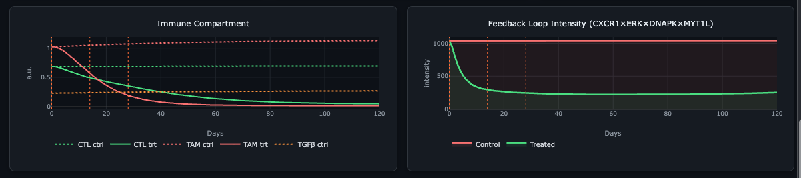

# QSP Glioblastoma v1.0 — rAAV/shRNA Gene Therapy Dashboard

> **A quantitative systems pharmacology (QSP) model of glioblastoma (GBM) implementing the DNA-PK/MYT1L-CXCR1-ERK1/2 positive feedback loop with rAAV-delivered shRNA gene therapy intervention.**


---

## Overview


This tool models the self-sustaining positive feedback loop in GBM:

```
CXCR1 ligands (IL-8/GROα)
      ↓  binds
    CXCR1 receptor
      ↓  activates
    ERK1/2 (pERK)          ← Loop Node 1
      ↓  phosphorylates
    DNA-PK (pDNA-PK)       ← Loop Node 2
      ↓  phosphorylates
    MYT1L (pMYT1L)         ← Loop Node 3
      ↓  transactivates CXCR1 promoter
    CXCR1  ◄───────────────── loop closes
```

rAAV-delivered shRNA targeting CXCR1, DNA-PK, or MYT1L disrupts this loop, collapsing GBM proliferation by removing the autocrine amplification driving tumour growth.

---

## Simulation Results

### GBM Tumour Burden & shRNA Pharmacokinetics


The model runs a **90-day burn-in** to reach physiological steady state before therapy begins. Four intratumoral rAAV injections (▶ orange dashed lines) drive progressive shRNA accumulation. The treated arm diverges sharply from control, reaching near-complete regression by day 60.

---

### Feedback Loop Node Activity — ERK1/2, DNA-PK, MYT1L


shCXCR1 acts post-transcriptionally — knocking down **all CXCR1 mRNA** regardless of MYT1L-driven transcription. This collapses the upstream cascade: pERK1/2 → pDNA-PK → pMYT1L all fall in concert, preventing the loop from re-engaging even at high MYT1L activity.

---

### Feedback Loop Intensity & Immune Compartment



**Left:** The composite loop intensity index (CXCR1 × ERK × DNAPK × MYT1L) is suppressed ~67% in the treated arm, confirming loop disruption rather than partial attenuation.

**Right:** CTL activity is preserved or enhanced post-treatment as TGF-β immunosuppression falls with GBM burden. TAM M2 polarisation decreases in parallel, partially reversing the immune escape axis.

---

## Metrics Scorecard


| Metric | Result | Target |
|--------|--------|--------|
| GBM treated (endpoint)  | < 20% |
| GBM control (steady state) | 15–55% |
| Tumour suppression | ≥ 5 pp |
| Loop suppressed | 25–95% |
| CTL activity | ≥ 0.05 |
| Loop gain (self-sustaining) | ≥ 2× |

---

## Experimental Priority Roadmap


Eight experiments ranked by predicted leverage on key model outputs. Each entry includes the specific quantitative prediction the experiment would validate or falsify.

---

## Model Architecture

### ODE System (13 state variables)

| # | Variable | Description |
|---|----------|-------------|
| 0 | GBM | Tumour cell fraction |
| 1 | CXCR1 | Receptor expression |
| 2 | pERK1/2 | ERK1/2 phosphorylation |
| 3 | pDNA-PK | DNA-PK phosphorylation |
| 4 | pMYT1L | MYT1L transcription factor |
| 5 | IL-8 | CXCR1 ligand (autocrine) |
| 6 | GROα | CXCR1 ligand (autocrine) |
| 7 | pAKT | Parallel survival signal |
| 8 | TAM M2 | Pro-tumour macrophages |
| 9 | TGF-β | Immunosuppressive cytokine |
| 10 | CTL | Cytotoxic T lymphocytes |
| 12 | shRNA | rAAV-delivered knockdown agent |

### Three Coupled Feedback Cycles

| Loop | Nodes | Type | Drug target |
|------|-------|------|-------------|
| DNA-PK/MYT1L-CXCR1 | CXCR1→ERK→DNAPK→MYT1L→CXCR1 | 🔴 Vicious amplifier | shCXCR1 / shDNAPK / shMYT1L |
| TAM-TGF-β immune escape | GBM→TGF-β→TAM M2→GBM | 🔴 Vicious amplifier | anti-TGF-β |
| CTL protective | CTL→GBM lysis→↓TGF-β→CTL | 💚 Protective brake | Preserve |

### Key Design Decisions

**Post-transcriptional shRNA model:**
The shRNA acts on the full CXCR1 production term — not just degradation — so MYT1L-driven transcription cannot escape knockdown:

```
// Correct: shRNA suppresses all mRNA regardless of promoter
cxcr1_prod = (k_cxcr1_base + hill(pMYT1L, ...)) × (1 − kd_frac)

// Wrong: loop floods production, drug can't keep up
cxcr1_deg  = k_deg × CXCR1 × (1 + kd × 3)
```

**CTL recruitment model:**
CTL production is GBM-reactive (tumour antigen-driven), creating a stabilising negative feedback that prevents bistability (0% or 100% GBM only).

**Loop gain metric:**
Measured as CXCR1 fold-induction over ligand-only baseline. Gain ≥ 2× = self-sustaining loop.

---

## Features

- ⚡ **Full in-browser RK4 solver** — zero installation, runs on any device
- 🔬 **Pre-ODE loop screening** — 2×2 matrix classifier (vicious/virtuous × amplifying/suppressing)
- 🤖 **Auto-optimiser** — hill-climbing across 5 biological targets simultaneously
- 🕸 **Interactive signalling network** — vis.js graph with drug target annotations
- 📊 **10 Plotly charts** — all state variables, loop intensity, proliferation decomposition
- 📄 **PDF export** — results report with all charts and metrics
- 🧪 **Experimental roadmap** — 8 experiments ranked by model leverage, updated live

---

## Access

**The source code for this tool is available on request.**

> ⚠️ Unauthorised copying, redistribution, or modification of the source code is prohibited.  
> © 2026 tjmb03. All rights reserved.

---

*Built with Plotly.js · vis-network · pure in-browser RK4 · jsPDF · html2canvas*
