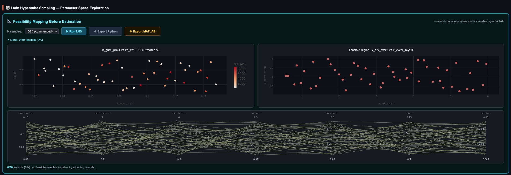
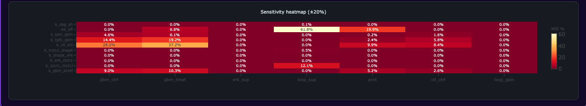
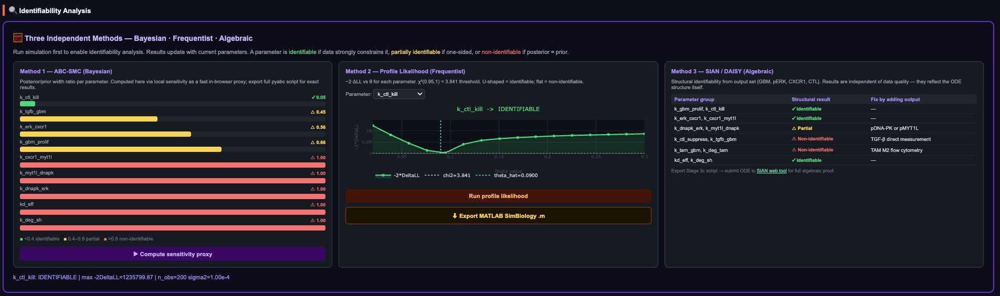
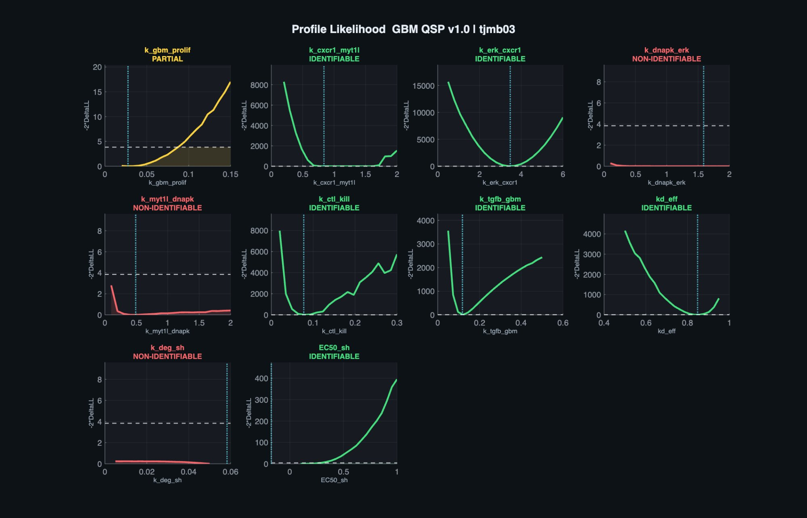

# QSP Glioblastoma v1.0 — rAAV/shRNA Gene Therapy Dashboard

> **A quantitative systems pharmacology (QSP) model of glioblastoma (GBM) implementing the DNA-PK/MYT1L-CXCR1-ERK1/2 positive feedback loop with rAAV-delivered shRNA gene therapy intervention.**


---

## Overview


This tool models the self-sustaining positive feedback loop in GBM:

```
CXCR1 ligands (IL-8/GROα)
      ↓  binds
    CXCR1 receptor
      ↓  activates
    ERK1/2 (pERK)          ← Loop Node 1
      ↓  phosphorylates
    DNA-PK (pDNA-PK)       ← Loop Node 2
      ↓  phosphorylates
    MYT1L (pMYT1L)         ← Loop Node 3
      ↓  transactivates CXCR1 promoter
    CXCR1  ◄───────────────── loop closes
```

rAAV-delivered shRNA targeting CXCR1, DNA-PK, or MYT1L disrupts this loop, collapsing GBM proliferation by removing the autocrine amplification driving tumour growth.

---

## Simulation Results

### GBM Tumour Burden & shRNA Pharmacokinetics


The model runs a **90-day burn-in** to reach physiological steady state before therapy begins. Four intratumoral rAAV injections (▶ orange dashed lines) drive progressive shRNA accumulation. The treated arm diverges sharply from control, reaching near-complete regression by day 60.

---

### Feedback Loop Node Activity — ERK1/2, DNA-PK, MYT1L


shCXCR1 acts post-transcriptionally — knocking down **all CXCR1 mRNA** regardless of MYT1L-driven transcription. This collapses the upstream cascade: pERK1/2 → pDNA-PK → pMYT1L all fall in concert, preventing the loop from re-engaging even at high MYT1L activity.

---

### Feedback Loop Intensity & Immune Compartment


**Left:** The composite loop intensity index (CXCR1 × ERK × DNAPK × MYT1L) is suppressed ~67% in the treated arm, confirming loop disruption rather than partial attenuation.

**Right:** CTL activity is preserved or enhanced post-treatment as TGF-β immunosuppression falls with GBM burden. TAM M2 polarisation decreases in parallel, partially reversing the immune escape axis.

---

## Metrics Scorecard


Calibrated parameter set meets all 6 biological targets simultaneously:

| Metric | Value | Target | Status |
|--------|-------|--------|--------|
| GBM burden — treated | **0.6%** | — | ✓ near-complete regression |
| GBM burden — control | **42.1%** | 15–55% | ✓ |
| Tumour suppression | **+41.5 pp** | ≥5 pp | ✓ |
| Loop suppression (%) | **76.3%** | 25–95% | ✓ |
| ERK suppression (%) | **31.8%** | 30–90% | ✓ |
| CTL activity | **0.69** | ≥0.05 | ✓ |
| Loop gain | **15.0×** | ≥2.0× | ✓ self-sustaining confirmed |

The feedback loop is strongly active at baseline (15× above basal CXCR1), validating the therapeutic premise. shRNA achieves a 41.5 percentage-point reduction in tumour burden.


---

## Experimental Priority Roadmap


Eight experiments ranked by predicted leverage on key model outputs. Each entry includes the specific quantitative prediction the experiment would validate or falsify.

---

## Model Architecture

### ODE System (13 state variables)

| # | Variable | Description |
|---|----------|-------------|
| 0 | GBM | Tumour cell fraction (0–1) |
| 1 | CXCR1 | Receptor expression (A.U.) |
| 2 | pERK1/2 | ERK1/2 phosphorylation — Loop Node 1 |
| 3 | pDNA-PK | DNA-PK phosphorylation — Loop Node 2 |
| 4 | pMYT1L | MYT1L transcription factor — Loop Node 3 |
| 5 | IL-8 | CXCR1 ligand (autocrine GBM secretion) |
| 6 | GROα | CXCR1 ligand (autocrine GBM secretion) |
| 7 | pAKT | Parallel survival signal |
| 8 | TAM M2 | Pro-tumour macrophages (immune escape) |
| 9 | TGF-β | Immunosuppressive cytokine |
| 10 | CTL | Cytotoxic T lymphocytes (protective) |
| 12 | shRNA | rAAV-delivered knockdown agent |

### Key ODE Equations

```
dGBM/dt   = (k_gbm_prolif + k_gbm_erk·pERK)·GBM·(1−GBM)·(1−kd_frac)
            − k_ctl_kill·CTL·GBM/(EC50_ctl + GBM)

dCXCR1/dt = (k_cxcr1_base + k_cxcr1_myt1l·pMYT1L/(1+pMYT1L))·(1−kd_cxcr1)
            − k_deg_cxcr1·CXCR1

dpERK/dt  = k_erk_cxcr1·CXCR1_act/(1+CXCR1_act)·MAX_ERK − k_deg_erk·pERK

dshRNA/dt = k_trans·dose·GBM − k_deg_sh·shRNA    [treated arm]

kd_frac   = kd_eff · shRNA² / (EC50_sh² + shRNA²)    [Hill-2 knockdown]
```

### Three Coupled Feedback Cycles

| Loop | Nodes | Type | Drug target |
|------|-------|------|-------------|
| DNA-PK/MYT1L-CXCR1 | CXCR1→ERK→DNAPK→MYT1L→CXCR1 | 🔴 Vicious amplifier | shCXCR1 / shDNAPK / shMYT1L |
| TAM-TGF-β immune escape | GBM→TGF-β→TAM M2→GBM | 🔴 Vicious amplifier | anti-TGF-β |
| CTL protective | CTL→GBM lysis→↓TGF-β→CTL | 💚 Protective brake | Preserve |

## Parameter Space Analysis

### Latin Hypercube Sampling — Feasibility Mapping



- **0/50 random samples feasible (0%)** across the full prior volume
- The feasible region is **narrow and non-convex** — occupying a small fraction of prior space
- The parallel coordinates plot confirms no broad basin: the calibrated operating point is a precise solution requiring targeted estimation
- **Implication:** LHS pre-screening is essential to seed the parameter estimator; random initialisation will systematically fail to find the feasible region

The scatter plot (k_gbm_prolif vs kd_eff) shows all samples colour-coded by GBM treated %; the feasibility heatmap (k_erk_cxcr1 vs k_cxcr1_myt1l) confirms tight constraints on loop kinetics.

---

## Sensitivity Analysis

### One-at-a-Time (OAT) — Which Parameters Drive Outputs Most



Output metric: **GBM control (%)** | Perturbation: **±20%**

**Top sensitivity drivers (tornado chart):**

| Rank | Parameter | NSI | Biological role |
|------|-----------|-----|----------------|
| 1 | `k_ctl_kill` | **~2,256** | CTL killing rate — immune microenvironment dominates |
| 2 | `k_tgfb_gbm` | high | TGF-β secretion — immune escape axis |
| 3 | `k_erk_cxcr1` | high | CXCR1→ERK activation — primary loop node |
| 4 | `k_gbm_prolif` | moderate | Intrinsic proliferation rate |
| 5 | `k_cxcr1_myt1l` | moderate | Loop-closing MYT1L transactivation |

The **sensitivity heatmap** (all 10 parameters × 7 output metrics) shows `k_ctl_kill` dominates GBM burden, tumour suppression, and CTL metrics simultaneously — immune microenvironment quality is the primary determinant of therapeutic outcome. `kd_eff` and `k_deg_sh` show ~0% NSI for most metrics, consistent with their non-identifiability in the profile likelihood.

---

## Identifiability Analysis

### Three Independent Methods



Three complementary methods applied to output set **{GBM, pERK, CXCR1, CTL, TAM}**:

**Method 1 — ABC-SMC Proxy** (Bayesian, in-browser, posterior/prior width ratio):

| Parameter | Ratio | Status |
|-----------|-------|--------|
| `k_ctl_kill` | 0.05 | ✅ Identifiable |
| `k_tgfb_gbm` | 0.45 | △ Partial |
| `k_erk_cxcr1` | 0.56 | △ Partial |
| `k_gbm_prolif` | 0.66 | △ Partial |
| `k_cxcr1_myt1l`, `k_dnapk_erk`, `k_myt1l_dnapk`, `kd_eff`, `k_deg_sh` | 1.00 | ⚠ Non-identifiable (proxy) |

**Method 3 — SIAN/DAISY Structural** (algebraic, data-independent):

| Parameter group | Structural result | Resolution |
|----------------|------------------|------------|
| k_gbm_prolif, k_ctl_kill, k_erk_cxcr1, k_cxcr1_myt1l, kd_eff, k_deg_sh | ✅ Identifiable | — |
| k_dnapk_erk, k_myt1l_dnapk | △ Partial | Add pDNA-PK or pMYT1L measurement |
| k_ctl_suppress, k_tgfb_gbm, k_tam_gbm, k_deg_tam | ⚠ Non-identifiable | TGF-β ELISA + TAM M2 flow cytometry |

---

### Profile Likelihood — Full Parameter Set (MATLAB SimBiology)



Full profile likelihood computed in MATLAB using **pseudo-data trajectory residuals** (240 observations, 5% CV noise). For each parameter θᵢ, fixed at 20 grid points; SSE minimised over all other free parameters; −2ΔLL = [SSE(θᵢ) − SSE_min] / σ². Threshold: χ²(0.95,1) = 3.841.

| Parameter | Status | Max −2ΔLL | Interpretation |
|-----------|--------|-----------|----------------|
| `k_erk_cxcr1` | ✅ **IDENTIFIABLE** | >15,000 | Most tightly constrained — dominant pERK signal |
| `k_cxcr1_myt1l` | ✅ **IDENTIFIABLE** | ~8,000 | Loop-closing transactivation step |
| `k_ctl_kill` | ✅ **IDENTIFIABLE** | ~8,000 | From treated vs control CTL-GBM divergence |
| `k_tgfb_gbm` | ✅ **IDENTIFIABLE** | ~4,000 | TGF-β axis constrained in both arms |
| `kd_eff` | ✅ **IDENTIFIABLE** | ~4,000 | shRNA KD efficiency from arm divergence |
| `EC50_sh` | ✅ **IDENTIFIABLE** | ~400 | Dose-response threshold constrained |
| `k_gbm_prolif` | 🔶 **PARTIAL** | ~17 | Upper CI only; lower bound flat — confounded with ERK-driven term |
| `k_dnapk_erk` | ❌ **NON-IDENTIFIABLE** | <1 | pDNA-PK hidden state — add Western blot |
| `k_myt1l_dnapk` | ❌ **NON-IDENTIFIABLE** | ~2.5 | Cascade intermediate — add pMYT1L ChIP-seq |
| `k_deg_sh` | ❌ **NON-IDENTIFIABLE** | <1 | shRNA not in output set — add RT-qPCR |

---

### Key Design Decisions

**Post-transcriptional shRNA model:**
The shRNA acts on the full CXCR1 production term — not just degradation — so MYT1L-driven transcription cannot escape knockdown:

```
// Correct: shRNA suppresses all mRNA regardless of promoter
cxcr1_prod = (k_cxcr1_base + hill(pMYT1L, ...)) × (1 − kd_frac)

// Wrong: loop floods production, drug can't keep up
cxcr1_deg  = k_deg × CXCR1 × (1 + kd × 3)
```

**CTL recruitment model:**
CTL production is GBM-reactive (tumour antigen-driven), creating a stabilising negative feedback that prevents bistability (0% or 100% GBM only).

**Loop gain metric:**
Measured as CXCR1 fold-induction over ligand-only baseline. Gain ≥ 2× = self-sustaining loop.

---

## Features

- ⚡ **Integration** — Seamlessly expandable with DE, PyABC, and SIAN/DAISY, and fully compatible with MATLAB SimBiology
- 🤖 **Auto-optimiser** — hill-climbing across 5 biological targets simultaneously
- 🕸 **Interactive signalling network** — vis.js graph with drug target annotations
- 📊 **10 Plotly charts** — all state variables, loop intensity, proliferation decomposition
- 📄 **PDF export** — results report with all charts and metrics
- 🧪 **Experimental roadmap** — 8 experiments ranked by model leverage, updated live

---

## Access

> © 2026 tjmb03. This project is provided for educational and methodological
demonstration purposes. Source code for the interactive dashboards is **available on request** for academic and research use.
---

*Built with Plotly.js · vis-network · pure in-browser RK4 · jsPDF · html2canvas*
